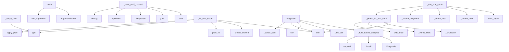

# System Architecture Analysis

## Overview

- **Project**: /home/tom/github/wronai/coresifu
- **Analysis Mode**: static
- **Total Functions**: 94
- **Total Classes**: 16
- **Modules**: 10
- **Entry Points**: 93

## Architecture by Module

### src.git_manager
- **Functions**: 16
- **Classes**: 1
- **File**: `git_manager.py`

### src.surgeon
- **Functions**: 15
- **Classes**: 2
- **File**: `surgeon.py`

### src.docker_runner
- **Functions**: 13
- **Classes**: 2
- **File**: `docker_runner.py`

### src.journal
- **Functions**: 13
- **Classes**: 1
- **File**: `journal.py`

### src.main
- **Functions**: 11
- **Classes**: 1
- **File**: `main.py`

### src.communicator
- **Functions**: 10
- **Classes**: 2
- **File**: `communicator.py`

### src.analyzer
- **Functions**: 8
- **Classes**: 3
- **File**: `analyzer.py`

### src.scenarios
- **Functions**: 6
- **Classes**: 3
- **File**: `scenarios.py`

### src.config
- **Functions**: 2
- **Classes**: 1
- **File**: `config.py`

## Key Entry Points

Main execution flows into the system:

### src.surgeon.Surgeon._apply_one
> Apply a single patch to one file.
- **Calls**: patch.get, patch.get, patch.get, patch.get, patch.get, self._backup, file_rel.endswith, self._make_diff

### src.main.main
- **Calls**: argparse.ArgumentParser, parser.add_argument, parser.add_argument, parser.add_argument, parser.add_argument, parser.add_argument, parser.add_argument, parser.add_argument

### src.communicator.Communicator._read_until_prompt
> Read output until we see the you> prompt or timeout.
- **Calls**: time.time, None.join, Response, raw.splitlines, log.debug, lines.append, self._all_output.append, self.PROMPT_PATTERN.search

### src.main.Supervisor._fix_one_issue
> Attempt to fix one issue. Returns True if patch applied.
- **Calls**: log.info, self.git.create_branch, self.analyzer.plan_fix, plan.get, self.surgeon.apply_plan, all, self.journal.record_patch, self.git.commit

### src.analyzer.Analyzer._rule_based_analysis
> Fast rule-based analysis without LLM.
- **Calls**: Diagnosis, re.findall, re.findall, diag.issues.append, diag.issues.append, None.strip, diag.issues.append, diag.issues.append

### src.analyzer.Analyzer.diagnose
> Analyze full session output and return diagnosis.
- **Calls**: self._rule_based_analysis, self._llm_call, diagnosis.issues.sort, log.info, self._parse_json, parsed.get, parsed.get, parsed.get

### src.main.Supervisor._run_one_cycle
> Run one improvement cycle. Returns outcome string.
- **Calls**: self.journal.start_cycle, self._phase_boot, self._phase_test, self._phase_diagnose, self._phase_fix_and_verify, self._shutdown, log.info, self.journal.finish_cycle

### src.main.Supervisor._phase_fix_and_verify
> Apply patches for fixable issues, then verify. Returns outcome.
- **Calls**: log.info, self._shutdown, log.info, self._verify_fixes, self.journal.was_tried, self._fix_one_issue, self.journal.finish_cycle, self.git.commit

### src.main.Supervisor.run
> Run the full improvement loop.
- **Calls**: log.info, self.git.init_if_needed, range, print, print, print, print, self.runner.build

### src.communicator.Communicator.send
> Send a command and wait for response with retry logic.
- **Calls**: log.info, range, Response, self._resync, self.proc.stdin.write, self.proc.stdin.flush, self._read_until_prompt, log.warning

### src.main.Supervisor._verify_fixes
> Re-run tests after applying fixes.
- **Calls**: self.runner.build, self.runner.start, Communicator, comm.wait_for_boot, ScenarioRunner, sr.run_all, all, src.scenarios.format_report

### src.surgeon.Surgeon.apply_plan
> Apply a full fix plan (from Analyzer.plan_fix).

Args:
    plan: {"patches": [...], "confidence": 0.8, ...}

Returns:
    List of PatchResult for each
- **Calls**: plan.get, plan.get, log.warning, len, log.warning, self._apply_one, results.append, PatchResult

### src.scenarios.ScenarioRunner.run_one
> Run a single scenario.
- **Calls**: log.info, ScenarioResult, time.time, scenario.get, round, log.info, self._run_step, result.steps.append

### src.surgeon.Surgeon._fuzzy_find
> Try to find approximate match for search string.

Useful when LLM gets whitespace or minor chars wrong.
- **Calls**: None.splitlines, text.splitlines, len, range, len, None.join, None.ratio, search.strip

### src.docker_runner.DockerRunner.build
> Build Docker image from coreskill source.
- **Calls**: log.info, dockerfile.exists, log.error, subprocess.run, log.info, log.error, log.error, Path

### src.surgeon.Surgeon._restore
> Restore from most recent backup.
- **Calls**: sorted, None.hexdigest, self.backup_dir.glob, shutil.copy2, log.info, str, str, hashlib.md5

### src.analyzer.Analyzer.plan_fix
> Plan a code fix for a specific issue.

Args:
    issue: The issue to fix
    file_contents: {filename: content} of affected files
- **Calls**: file_contents.items, self._llm_call, self._parse_json, log.info, log.warning, len, self._truncate_to_context, parsed.get

### src.config.Config.__post_init__
- **Calls**: None.resolve, None.resolve, None.resolve, None.resolve, os.environ.get, d.mkdir, Path, Path

### src.docker_runner.SubprocessRunner.start
> Start coreskill as direct subprocess.
- **Calls**: os.environ.copy, log.info, subprocess.Popen, str, list, log.error, env.keys, str

### src.scenarios.ScenarioRunner._run_step
> Execute one test step.
- **Calls**: step.get, step.get, step.get, self.comm.send, resp.raw.lower, StepResult, any, pattern.lower

### src.scenarios.ScenarioRunner.load_custom_scenarios
> Load additional scenarios from YAML file.
- **Calls**: path.exists, SCENARIOS.update, log.info, open, log.warning, yaml.safe_load, len, str

### src.communicator.Communicator._read_loop
> Background: read chars from stdout into queue (handles prompts without newlines).
- **Calls**: self.proc.stdout.read, log.error, self._queue.put, self._queue.put, self.PROMPT_PATTERN.search, self._queue.put, self._queue.put, str

### src.journal.Journal.was_tried
> Check if this issue was already attempted.

Returns the attempt record or None.
- **Calls**: None.strip, cycle.get, issue_desc.lower, None.strip, None.lower, len, len, cycle.get

### src.main.Supervisor._phase_boot
> Boot coreskill and wait for prompt. Returns boot Response or None.
- **Calls**: log.info, self.runner.start, Communicator, self._comm.wait_for_boot, log.info, self.journal.finish_cycle, log.error, self._shutdown

### src.git_manager.GitManager.merge_to_main
> Merge fix branch back to main.
- **Calls**: self._detect_main_branch, self._run, self._run, log.info, self._run, log.error, self._run, self._run

### src.scenarios.ScenarioRunner.run_all
> Run all or selected scenarios. Returns list of results.
- **Calls**: list, self.run_one, results.append, SCENARIOS.keys, log.warning, scenario.get, log.error

### src.analyzer.Analyzer._parse_json
> Extract JSON from LLM response (handles markdown fences).
- **Calls**: re.sub, re.sub, text.strip, json.loads, re.search, json.loads, match.group

### src.analyzer.Analyzer._truncate_to_context
> Truncate large file keeping the region most relevant to the evidence.

Tries to center the window around the first occurrence of evidence text.
Falls 
- **Calls**: len, None.strip, content.find, max, min, len, len

### src.communicator.Communicator._resync
> Wait for you> prompt after a timed-out command before sending next one.
- **Calls**: log.debug, time.time, log.warning, self.PROMPT_PATTERN.search, time.time, self._queue.get, log.debug

### src.surgeon.Surgeon._backup
> Create timestamped backup.
- **Calls**: None.strftime, backup.write_text, None.hexdigest, datetime.now, hashlib.md5, None.encode, str

## Process Flows

Key execution flows identified:

### Flow 1: _apply_one
```
_apply_one [src.surgeon.Surgeon]
```

### Flow 2: main
```
main [src.main]
```

### Flow 3: _read_until_prompt
```
_read_until_prompt [src.communicator.Communicator]
```

### Flow 4: _fix_one_issue
```
_fix_one_issue [src.main.Supervisor]
```

### Flow 5: _rule_based_analysis
```
_rule_based_analysis [src.analyzer.Analyzer]
```

### Flow 6: diagnose
```
diagnose [src.analyzer.Analyzer]
```

### Flow 7: _run_one_cycle
```
_run_one_cycle [src.main.Supervisor]
```

### Flow 8: _phase_fix_and_verify
```
_phase_fix_and_verify [src.main.Supervisor]
```

### Flow 9: run
```
run [src.main.Supervisor]
```

### Flow 10: send
```
send [src.communicator.Communicator]
```

## Key Classes

### src.git_manager.GitManager
> Manages git operations on coreskill repo.

Workflow:
1. Create branch: supervisor/fix-{issue}
2. App
- **Methods**: 16
- **Key Methods**: src.git_manager.GitManager.__init__, src.git_manager.GitManager._run, src.git_manager.GitManager.is_repo, src.git_manager.GitManager.init_if_needed, src.git_manager.GitManager.current_branch, src.git_manager.GitManager.is_clean, src.git_manager.GitManager.stash_if_dirty, src.git_manager.GitManager.stash_pop, src.git_manager.GitManager.create_branch, src.git_manager.GitManager.commit

### src.journal.Journal
> Records every action: what was tested, found, patched, verified.

Enables:
- Don't repeat failed fix
- **Methods**: 13
- **Key Methods**: src.journal.Journal.__init__, src.journal.Journal._load, src.journal.Journal._empty, src.journal.Journal._save, src.journal.Journal.start_cycle, src.journal.Journal.record_issues, src.journal.Journal.record_patch, src.journal.Journal.record_verification, src.journal.Journal.finish_cycle, src.journal.Journal.was_tried

### src.surgeon.Surgeon
> Applies code patches to coreskill source.

Safety rules:
- Always creates backup before modifying
- 
- **Methods**: 13
- **Key Methods**: src.surgeon.Surgeon.__init__, src.surgeon.Surgeon.apply_plan, src.surgeon.Surgeon._apply_one, src.surgeon.Surgeon._backup, src.surgeon.Surgeon._restore, src.surgeon.Surgeon._rollback_files, src.surgeon.Surgeon.rollback_last, src.surgeon.Surgeon._check_syntax, src.surgeon.Surgeon._fuzzy_find, src.surgeon.Surgeon._make_diff

### src.communicator.Communicator
> Send commands to coreskill and read responses.

Uses a background reader thread to handle stdout non
- **Methods**: 10
- **Key Methods**: src.communicator.Communicator.__init__, src.communicator.Communicator._read_loop, src.communicator.Communicator.wait_for_boot, src.communicator.Communicator._resync, src.communicator.Communicator.send, src.communicator.Communicator._read_until_prompt, src.communicator.Communicator.send_and_expect, src.communicator.Communicator.is_alive, src.communicator.Communicator.get_full_log, src.communicator.Communicator.close

### src.main.Supervisor
> The outer core. Runs improvement cycles on coreskill.

Each cycle:
  boot → test → diagnose → [plan 
- **Methods**: 10
- **Key Methods**: src.main.Supervisor.__init__, src.main.Supervisor.run, src.main.Supervisor._run_one_cycle, src.main.Supervisor._phase_boot, src.main.Supervisor._phase_test, src.main.Supervisor._phase_diagnose, src.main.Supervisor._phase_fix_and_verify, src.main.Supervisor._fix_one_issue, src.main.Supervisor._verify_fixes, src.main.Supervisor._shutdown

### src.analyzer.Analyzer
> Analyzes coreskill output using LLM.
- **Methods**: 8
- **Key Methods**: src.analyzer.Analyzer.__init__, src.analyzer.Analyzer._llm_call, src.analyzer.Analyzer._parse_json, src.analyzer.Analyzer.diagnose, src.analyzer.Analyzer._rule_based_analysis, src.analyzer.Analyzer.plan_fix, src.analyzer.Analyzer._truncate_to_context, src.analyzer.Analyzer._extract_traceback

### src.docker_runner.DockerRunner
> Build, start, stop coreskill Docker containers.
- **Methods**: 6
- **Key Methods**: src.docker_runner.DockerRunner.__init__, src.docker_runner.DockerRunner.available, src.docker_runner.DockerRunner.build, src.docker_runner.DockerRunner.start, src.docker_runner.DockerRunner.stop, src.docker_runner.DockerRunner.cleanup

### src.docker_runner.SubprocessRunner
> Run coreskill directly as subprocess (no Docker).
- **Methods**: 6
- **Key Methods**: src.docker_runner.SubprocessRunner.__init__, src.docker_runner.SubprocessRunner.available, src.docker_runner.SubprocessRunner.build, src.docker_runner.SubprocessRunner.start, src.docker_runner.SubprocessRunner.stop, src.docker_runner.SubprocessRunner.cleanup

### src.scenarios.ScenarioRunner
> Runs test scenarios against a live coreskill communicator.
- **Methods**: 5
- **Key Methods**: src.scenarios.ScenarioRunner.__init__, src.scenarios.ScenarioRunner.run_all, src.scenarios.ScenarioRunner.run_one, src.scenarios.ScenarioRunner._run_step, src.scenarios.ScenarioRunner.load_custom_scenarios

### src.scenarios.ScenarioResult
> Result of running a full scenario.
- **Methods**: 2
- **Key Methods**: src.scenarios.ScenarioResult.failed_steps, src.scenarios.ScenarioResult.error_steps

### src.surgeon.PatchResult
> Result of applying a single patch.
- **Methods**: 2
- **Key Methods**: src.surgeon.PatchResult.__init__, src.surgeon.PatchResult.__repr__

### src.config.Config
> All supervisor settings.
- **Methods**: 2
- **Key Methods**: src.config.Config.__post_init__, src.config.Config.validate

### src.scenarios.StepResult
> Result of one scenario step.
- **Methods**: 0

### src.analyzer.Issue
> A single detected issue.
- **Methods**: 0

### src.analyzer.Diagnosis
> Complete diagnosis from analyzing a session.
- **Methods**: 0

### src.communicator.Response
> Single response from coreskill.
- **Methods**: 0

## Data Transformation Functions

Key functions that process and transform data:

### src.scenarios.format_report
> Format scenario results as human-readable report.
- **Output to**: sum, sum, sum, lines.append, lines.append

### src.analyzer.Analyzer._parse_json
> Extract JSON from LLM response (handles markdown fences).
- **Output to**: re.sub, re.sub, text.strip, json.loads, re.search

### src.config.Config.validate
> Return list of config errors.
- **Output to**: self.coreskill_path.exists, errors.append, errors.append, None.exists, errors.append

## Public API Surface

Functions exposed as public API (no underscore prefix):

- `src.main.main` - 45 calls
- `src.analyzer.Analyzer.diagnose` - 20 calls
- `src.main.Supervisor.run` - 17 calls
- `src.communicator.Communicator.send` - 16 calls
- `src.scenarios.format_report` - 15 calls
- `src.surgeon.Surgeon.apply_plan` - 14 calls
- `src.scenarios.ScenarioRunner.run_one` - 13 calls
- `src.docker_runner.DockerRunner.build` - 11 calls
- `src.analyzer.Analyzer.plan_fix` - 10 calls
- `src.docker_runner.SubprocessRunner.start` - 9 calls
- `src.scenarios.ScenarioRunner.load_custom_scenarios` - 9 calls
- `src.journal.Journal.was_tried` - 9 calls
- `src.git_manager.GitManager.merge_to_main` - 8 calls
- `src.scenarios.ScenarioRunner.run_all` - 7 calls
- `src.surgeon.Surgeon.list_files` - 7 calls
- `src.git_manager.GitManager.log_recent` - 6 calls
- `src.docker_runner.DockerRunner.start` - 5 calls
- `src.docker_runner.create_runner` - 5 calls
- `src.communicator.Communicator.close` - 5 calls
- `src.git_manager.GitManager.init_if_needed` - 5 calls
- `src.git_manager.GitManager.commit` - 5 calls
- `src.journal.Journal.record_issues` - 5 calls
- `src.journal.Journal.record_patch` - 5 calls
- `src.journal.Journal.recurring_issues` - 5 calls
- `src.journal.Journal.summary` - 5 calls
- `src.surgeon.Surgeon.rollback_last` - 5 calls
- `src.config.Config.validate` - 5 calls
- `src.git_manager.GitManager.create_branch` - 4 calls
- `src.git_manager.GitManager.reset_branch` - 4 calls
- `src.journal.Journal.start_cycle` - 4 calls
- `src.journal.Journal.record_verification` - 4 calls
- `src.journal.Journal.finish_cycle` - 4 calls
- `src.communicator.Communicator.send_and_expect` - 3 calls
- `src.git_manager.GitManager.stash_if_dirty` - 3 calls
- `src.surgeon.Surgeon.read_file` - 3 calls
- `src.docker_runner.DockerRunner.stop` - 2 calls
- `src.communicator.Communicator.wait_for_boot` - 2 calls
- `src.git_manager.GitManager.current_branch` - 2 calls
- `src.git_manager.GitManager.is_clean` - 2 calls
- `src.docker_runner.DockerRunner.available` - 1 calls

## System Interactions

How components interact:



## Reverse Engineering Guidelines

1. **Entry Points**: Start analysis from the entry points listed above
2. **Core Logic**: Focus on classes with many methods
3. **Data Flow**: Follow data transformation functions
4. **Process Flows**: Use the flow diagrams for execution paths
5. **API Surface**: Public API functions reveal the interface

## Context for LLM

Maintain the identified architectural patterns and public API surface when suggesting changes.